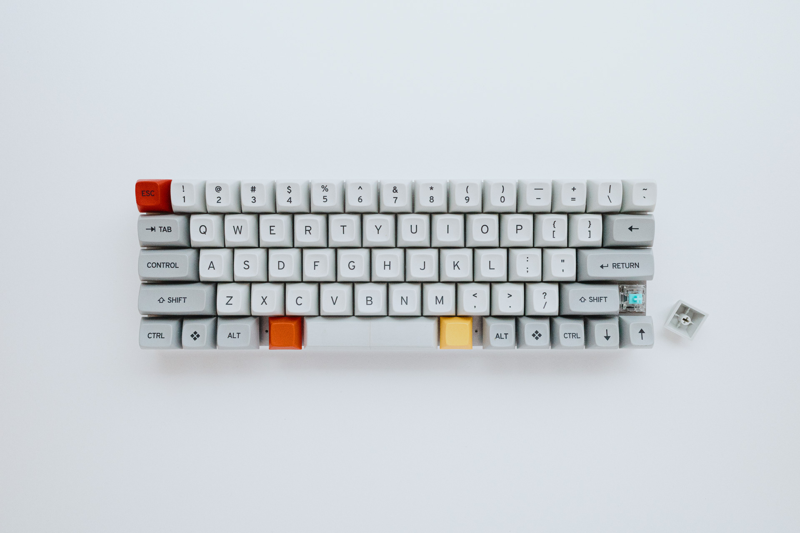
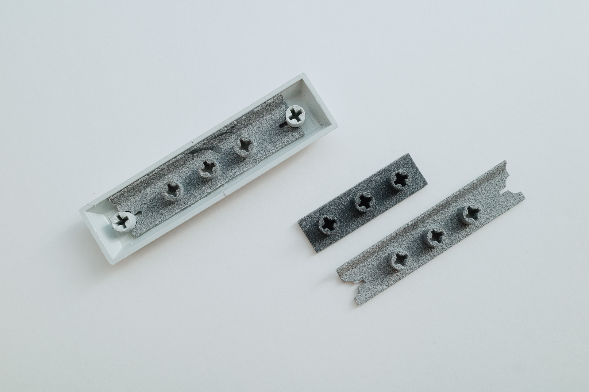
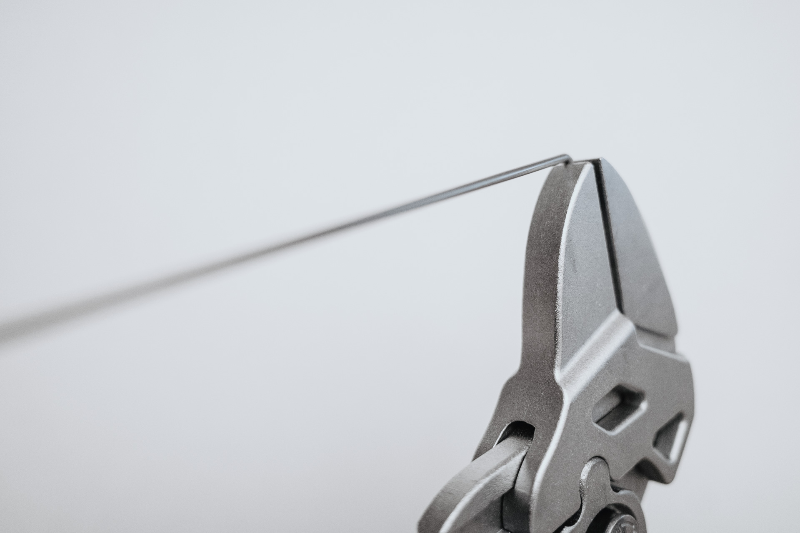
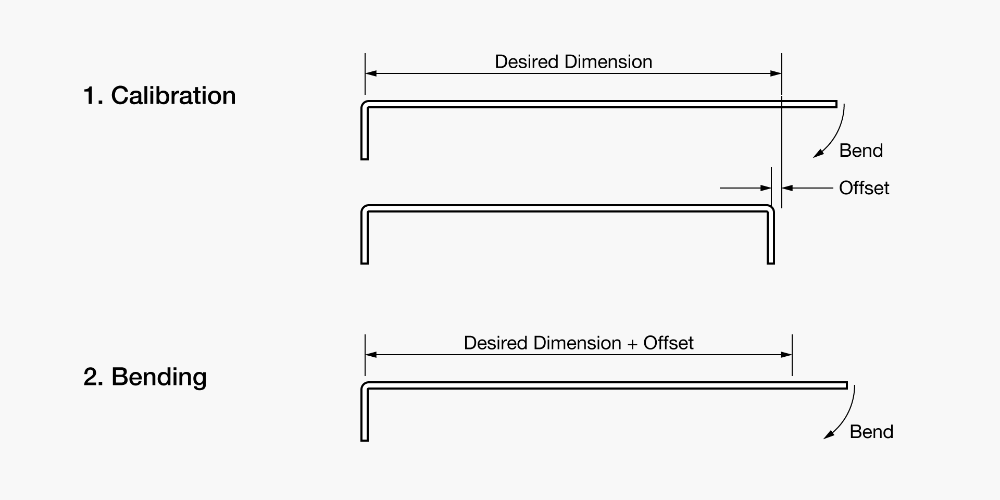

# 4uスペースバーを作る

これは，キーボード Advent Calendar 2019 2日目の記事です．

## はじめに

### キーキャップサイズの選択肢には限りがある

独自のキー配列を作ることは，キーボードを設計する主要な目的のうちのひとつです．しかし，ほとんどの場合はキーキャップのサイズは入手性の良いものに限られてしまいます．特殊なサイズのキーキャップは，ほとんど既製品が存在しません．

もしそのようなサイズのものを使用したい場合は，自作するのがよいでしょう．私が最初に設計したキーボードでは，既存のスペースバーを使って4uのスペースバーを自作しました．

### 既製品 4u スペースバーの入手

写真掲載の MT3 /dev/tty keycap には 4u スペースバーがありますが，しばらく再生産されていません．また， Signature Plastics では SA プロファイルの 4u スペースバーが製造されていますが，こちらは高さが高いうえ，カラーバリエーションも多くありません．

### 既存手法の限界

上記のように既製品のキーキャップが使えなかったので，自作することにしました．

従来の自作キーキャップの主流は，次の2種類に大別できます：3Dプリントと，Artisan キーキャップです（自前で射出成形を行う猛者もいますが，少数派です）．前者の場合，3Dプリントできる材質を使う必要があります．これは，既存のキーキャップと色や質感が合いません．後者の場合は，制作に手間がかかります．さらに，共通する問題として，両者とも既製品のキーキャップほど摩耗に強くありません．

### 新手法

最終的に 7u キーキャップを切断し，繋ぎ合わせて長さを詰めることにしました．なお，スペースバーは遊舎工房で入手したものです．詳細は不明ですが，おそらく PBT だと思われます．

## キーキャップの製作

### スペースバーを中央で切って接着する

まず，一番単純な方法から試してみることにしました．接着したキーキャップは接着剤を削り取って再利用したので，写真は残っていません．試した接着剤は以下の通りです：

- アロンアルファ（瞬間接着剤）
- クイックメンダー（エポキシ接着剤）

強度不足により壊れました．接着面が小さかったこと，極端な条件に対してそれほど適切ではない接着剤を用いたことなどが原因として考えられます．

### 3Dプリント部材で裏から補強する

3Dプリントで裏板を作り，補強してみました．出力は[DMM 3Dプリント](https://make.dmm.com/print/)で行いました．キーキャップの断面は，直線と円弧だけで構成されていると仮定して作図しました．

左から，完成品，試作1回目，試作2回目です．

#### 試作1回目

材質は PA12 MJF です．試した接着条件は次の通りです：

- ボンド スーパーX（多用途弾性接着剤）
- アロンアルファ（瞬間接着剤）

最初に作ったもの（写真中央の短いもの）では，キーキャップの接着部分が壊れました．裏板の剛性が足りず，接着部分に力がかかったのが原因だと考えられます．これは特にスーパーXを用いたときに顕著でした．

#### 試作2回目

以下3点の改良を行いました（写真左右）．

1. 裏板をキーキャップに干渉しないぎりぎりまで長く・厚くし，剛性を稼ぐ．
2. 通常の材質 (PA12) と比較して剛性の高い材質 (PA12GB) を用いる.
3. 強力な接着剤を用いる.

接着条件は次の通りです．今回は使用する接着剤を特定するために HENKEL の [Design Guide for Bonding Plastics](http://dm.henkel-dam.com/is/content/henkel/LT-2197_Plastic%20Guide_v6%20LRpdf) を参照しました．このガイドでは，HENKEL製品を用いたときの樹脂の表面処理やフィラーによる接着力の変化が広くカバーされています．

- Loctite 401 Prism
- Loctite 770 Prism Primer（キーキャップ側のみに塗布）

## スタビライザの製作

スタビライザ両端のパーツは GMK の既製品を流用し，針金だけ新しく作ることにします．

スペースバーは両端から 0.5u ずつのところにステムがあり， 4u のスペースバーを作る場合はワイヤの寸法は芯々で 3u です．GMKのスタビライザに使われている針金を測定したら Φ1.6 (1/16 inch?) でしたが，今回はホームセンター等で簡単に買える Φ1.5 のピアノ線を使いました．ピアノ線は高価なものではなく，また曲げにややコツが要るので，1mくらい買っておきましょう．

曲げに何度か失敗しましたが，次の手順により必要な精度が得られました：(1)まず，設計通りの長さで針金を曲げます．このとき，仕上がり長さには多少の誤差が生じます．この誤差を測定します．(2)新しい針金を用意し，測定された誤差を加えた長さで曲げます．仕上がりが +/- 0.5mm 以内なら動作するようです．

## 今後の課題

- 勘によらない樹脂の特定．
- 合わせ目を美しく接着する方法．
- キーキャップの断面のよりよい測定方法．

## キーボードについて

この記事は現在制作中の60%キーボード Sugi 60（記事中写真参照）で書きました．キースイッチは Zilent 62g + Sprit 65p + 205g0（スペースバーのみ Stock Roselios），BGM は [Nightfall (Alice Sara Ott, 2018)](https://www.alicesaraott.com/store-items/nightfall/) でした．
